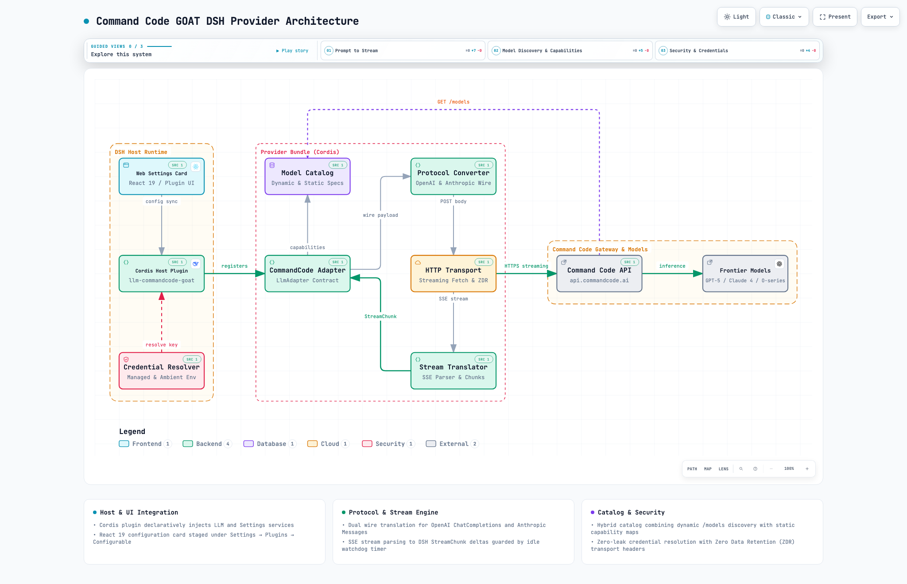

# dsh-commandcode-goat-provider

Direct provider bundle integrating **Command Code GOAT** with **DeepSeek Harness (DSH)** Web profile.

## Overview

This package is a native, external DSH bundle providing first-class access to bleeding-edge reasoning and coding models from the Command Code Provider API (`https://api.commandcode.ai`).

### Key Features

- **Direct Provider Integration**: Connects straight to Command Code Provider API (`/provider/v1/models`, `/provider/v1/chat/completions`, `/provider/v1/messages`) without local proxies or daemon intermediaries.
- **Dual Wire Translation**: Dynamically maps requests and SSE streams between DSH's internal streaming protocol (`StreamChunk`) and OpenAI / Anthropic wire formats based on model family and custom overrides.
- **Dynamic Catalog & Static Fallbacks**: Normalizes live discovery results from `/provider/v1/models` while preserving static capability hints for known models (e.g. `gpt-5.6-luna`, `claude-sonnet-4-6`).
- **Web Settings Card**: Registers an accessible, localized configuration card under **Settings → Plugins → Configurable** (`llm-commandcode-goat`) with write-only credential staging.
- **Security & Privacy**: API keys are resolved exclusively through DSH's credential store (`ctx.credentials`) or ambient launch environment (`COMMANDCODE_API_KEY`) and are never written to disk, logged, or exposed in the UI. Supports Zero Data Retention (ZDR) routing.

## Configuration

The bundle is configured under the `llm-commandcode-goat` settings namespace:

| Field | Type | Default | Description |
| :--- | :--- | :--- | :--- |
| `apiKeyEnv` | `string` | `COMMANDCODE_API_KEY` | Environment variable name for credential resolution. |
| `baseURL` | `string` | `https://api.commandcode.ai` | Base URL of the Command Code Provider API. |
| `defaultContextWindow` | `number` | `262144` (256K tokens) | Fallback context window capacity for unknown models. |
| `maxTokens` | `number` | `65536` | Maximum completion tokens cap per request. |
| `requestTimeoutMs` | `number` | `60000` (60s) | Timeout for establishing initial HTTP/SSE stream response. |
| `streamIdleTimeoutMs` | `number` | `300000` (5m) | Maximum silence duration between streaming chunks before aborting. |
| `enableZdr` | `boolean` | `false` | When enabled, requests Zero Data Retention from supported providers. |
| `protocolOverrides` | `Array<{ model, protocol }>` | `[]` | Explicit wire protocol mappings (`openai` or `anthropic`). |

## Quota & outage auto-switch

The DeepSeek V4.1 Flash pair (`opencode-go-v41/deepseek-flash` ⇄ `commandcode-goat/deepseek/deepseek-v4.1-flash`) switches automatically, and the session-header badge shows both sides' quota plus the last switch. Configured under the `usage-failover` namespace:

| Field | Type | Default | Description |
| :--- | :--- | :--- | :--- |
| `enabled` | `boolean` | `true` | Master switch for both triggers. |
| `threshold` | `number` | `80` | Usage percent that triggers a quota switch. |
| `refreshIntervalMs` | `number` | `60000` | Minimum ms between quota refetches. |
| `outageCooldownMs` | `number` | `120000` | How long a failed side stays disqualified as a failover target. |

- **Quota trigger** — at `agent/pre-step`, when the active side's peak window reaches `threshold` and the alternative is below it.
- **Outage trigger** — at `agent/request-error`, after the failing provider's own retry budget is spent (`llm-retry` runs first, this listener is outermost). The switch is queued for the current run's next request, so the retry leaves the failing route inside the same step.
- `AUTH`, `PLAN_REQUIRED`, `QUOTA`, `RATE_LIMIT`, `SERVER`, `TIMEOUT`, `TRANSPORT`, `NETWORK`, `PI_AI_ERROR`, `EMPTY_RESPONSE` and HTTP 408/429/5xx count as an unusable route. `ABORTED`, `CONTEXT_WINDOW_EXCEEDED`, and `INVALID_REQUEST` do not: they repeat identically on the other side.
- Two guards stop the pair from trading the session: a side that failed inside `outageCooldownMs` is not a target, and a target already at `threshold` is left alone.

## Architecture & Integration

[](https://hidenobunagai.github.io/dsh-commandcode-goat-provider/)

> 🌐 **[View Interactive Architecture Diagram (GitHub Pages)](https://hidenobunagai.github.io/dsh-commandcode-goat-provider/)**  
> Explore interactive views, route tracing, light/dark themes, and repository source mappings.

- **Host Service**: `src/index.ts` exports a standard Cordis plugin declaring `inject: { llm, attachments }` and registers the `commandcode-goat` adapter, configurable provider metadata, model discovery, and settings listeners.
- **Browser Client**: `src/client/index.ts` exports a CJS lazy module registered via `dsh.client` that injects the configuration card into the `settings.plugin.item` slot.
- **Patch Manifest**: `cordis.patch.yml` specifies the single declarative entry row required for DSH deployment profiles. This file is read by `dsh bundle` at deploy time — do not rename or remove it.
- **Model Catalog**: `src/catalog/data.ts` is the single source of truth for all known models; `src/catalog/index.ts` derives pricing, capability, and display maps from it. Add new models there — never in multiple places. See [docs/model-sync.md](docs/model-sync.md) for the sync, version-bump, and publish procedure.

## Development & Verification

```bash
# Run full test suite (unit, conversion, stream translation, card, composition)
bun run test

# Run TypeScript typecheck
bun run typecheck

# Run linter
bun run lint

# Build host ESM and browser client CJS artifacts
bun run build
```

## License

MIT
